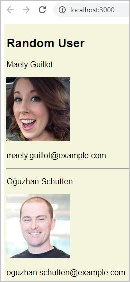
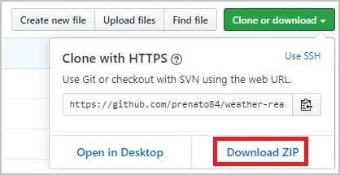

# :stopwatch: Projeto Fetch with Axios

Projeto que utiliza a biblioteca Axios para realizar consultas assíncronas à API do **[Randomuser.me](https://randomuser.me/)**.

Após obter o JSON de resposta com dados aleatórios de usuários, eles são exibidos por meio de um componente React :electron:.

<p align="center">
  
</p>

### :keyboard: Instalação e Execução

- Clone este repositório

```
> git clone https://github.com/prenato84/fetch-with-axios.git
```

- Acesse a pasta principal do projeto

```
> cd fetch-with-axios
```

- Instale as dependências

```
npm install
```

- Inicie o projeto

```
npm start
```

- Se seu navegador não abrir automaticamente a página do projeto, acesse o endereço `http://localhost:3000/`.

### :man_technologist: Pré-requisitos do Ambiente

- Interpretador Javascriot **[Node JS](https://nodejs.org/en/download/)**
- Sistema de versionamento **[Git](https://git-scm.com/)**

OBS: caso não deseja utilizar o Git, pode baixar o projeto diretamente da página do GitHub

<p align="center">
  
</p>

### :memo: Licença

Esse projeto está sob a licença MIT.

---

Feito com 💜 by <a href="https://www.linkedin.com/in/prenato84">Paulo Castro</a> :wave:
